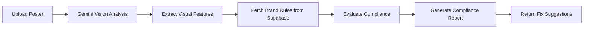

# Poster Review Agent


**AI-powered brand compliance checker for marketing posters.** Upload a poster image, and the agent automatically reviews it against brand rules — fonts, colors, logo placement, spacing, and more — using Gemini Vision + Supabase + Google Apps Script.

Built during my internship at **Atoms Digital Solutions**.

---

## The Problem

Design teams at growing companies send out dozens of poster variations across teams, vendors, and campaigns. Small brand violations slip through:
- Wrong font or color shade
- Logo placed too close to the edge
- Missing tagline or incorrect tagline
- Inconsistent spacing or alignment

Manual review is slow and inconsistent. By the time a mistake is caught, the poster may already be printed or shared.

---

## What It Does

1. **Upload** a poster image (PNG/JPG)
2. **Agent analyzes** the visual using Gemini Vision
3. **Stores** brand rules and analysis results in Supabase
4. **Returns** a structured compliance report:
   - Pass / Fail per rule
   - Confidence score
   - Violation description + suggested fix
   - Visual annotation of the problem area

---

## How It Works



1. User uploads a poster image via the web app
2. Gemini Vision analyzes layout, typography, color, and logo data
3. Brand rules are fetched from Supabase
4. Each rule is evaluated for compliance
5. A structured report is returned with pass/fail per rule and actionable fixes

---

## Tech Stack

| Component | Tool |
|-----------|------|
| **AI / Vision** | Google Gemini API (Vision) |
| **Backend Logic** | Google Apps Script |
| **Frontend** | HTML / CSS / JavaScript |
| **Database** | Supabase |
| **Storage** | Supabase Storage |

---

## Key Features

- **Brand rule management** — store and manage brand guidelines in Supabase
- **Multi-rule checking** — fonts, colors, logo placement, spacing, taglines
- **Structured reports** — pass/fail per rule with confidence scores
- **Actionable fixes** — not just "wrong color", but "replace #FF5733 with brand blue #0055FF"
- **API-driven** — Gemini API integration via Apps Script
- **Web app interface** — upload, review, and export flow in the browser

---

## Impact

- Reduced manual poster review time from ~20 minutes to under 2 minutes
- Caught brand violations before print/distribution
- Created a reusable brand-compliance pipeline applicable to any visual asset

---

## Project Structure

```
├── Code.gs           # Google Apps Script — backend logic, Gemini API calls
├── Index.html        # Frontend web app interface
└── README.md
```

---

## Built By

**Mokshith Puvvada**  
AI/ML Intern, Atoms Digital Solutions Pvt. Ltd.  
B.Tech Computer Science, 2nd Year (2026 batch)

---

> *Built during my internship at Atoms Digital Solutions, Guntur, Andhra Pradesh.*

## Connect

If you're building AI-powered design tools, I'd love to connect.

[LinkedIn](https://www.linkedin.com/in/mokshith-puvvada/) · [GitHub](https://github.com/Mokshith1817/Poster-Review-Agent)

---

## License

MIT
