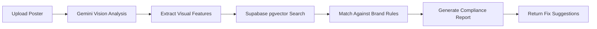

# Poster Review Agent


**AI-powered brand compliance checker for marketing posters.** Upload a poster image, and the agent automatically reviews it against brand rules — fonts, colors, logo placement, spacing, and more — using Gemini Vision + Supabase pgvector semantic search.

Built during my internship at **Atoms Digital Solutions**.

---

## The Problem

Marketing teams at growing companies send out dozens of poster variations across teams, vendors, and campaigns. Small brand violations slip through:
- Wrong font or color shade
- Logo placed too close to the edge
- Missing tagline or incorrect tagline
- Inconsistent spacing or alignment

Manual review is slow and inconsistent. By the time a mistake is caught, the poster may already be printed or shared.

---

## What It Does

1. **Upload** a poster image (PNG/JPG)
2. **Agent analyzes** the visual using Gemini Vision
3. **Vector search** against your stored brand guidelines in Supabase pgvector
4. **Returns** a structured compliance report:
   - Pass / Fail per rule
   - Confidence score
   - Violation description + suggested fix
   - Visual annotation of the problem area

---

## How It Works



1. User uploads a poster image
2. Gemini Vision extracts layout, typography, color, and logo data
3. The extracted features are embedded and searched against brand rule vectors in Supabase
4. Matched rules are evaluated for compliance
5. A structured report is returned with pass/fail per rule and actionable fixes

---

## Tech Stack

| Component | Tool |
|-----------|------|
| **AI / Vision** | Google Gemini API (Vision) |
| **Vector Store** | Supabase pgvector |
| **Backend** | Node.js / Python |
| **Frontend** | Web app / API |
| **Storage** | Supabase Storage |

---

## Key Features

- **Brand rule ingestion** — upload brand guidelines once, store as vector embeddings
- **Multi-rule checking** — fonts, colors, logo placement, spacing, taglines
- **Semantic search** — pgvector finds the closest matching brand rule, even with paraphrased descriptions
- **Confidence scoring** — know how sure the model is for each violation
- **Actionable fixes** — not just "wrong color", but "replace #FF5733 with brand blue #0055FF"
- **API-first** — easy to integrate into design review pipelines

---

## Impact

- Reduced manual poster review time from ~20 minutes to under 2 minutes
- Caught brand violations before print/social distribution
- Created a reusable brand-compliance pipeline applicable to any visual asset

---

## Project Structure

```
├── src/
│   ├── agent/
│   │   ├── vision.js        # Gemini Vision integration
│   │   ├── embedding.js     # Text/image embedding
│   │   └── rules.js         # Brand rule processing
│   ├── routes/
│   │   └── review.js        # API endpoints
│   └── index.js             # Server entry
├── supabase/
│   └── migrations/
│       └── create_pgvector.sql
└── README.md
```

---

## Built By

**Mokshith Puvvada**  
AI/ML Intern, Atoms Digital Solutions Pvt. Ltd.  
B.Tech Computer Science, 2nd Year (2026 batch)

---

> *Built during my internship at Atoms Digital Solutions, Guntur, Andhra Pradesh.*

## Connect

If you're building AI-powered design tools, I'd love to connect.

[LinkedIn](https://www.linkedin.com/in/mokshith-puvvada/) · [GitHub](https://github.com/Mokshith1817)

---

## License

MIT
